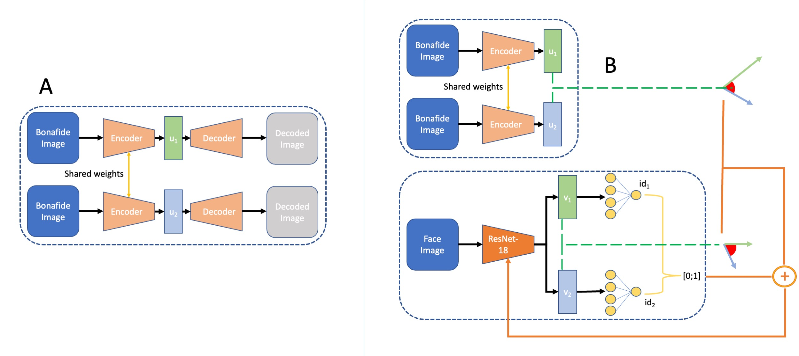

# IDistill

Official repository for the Unveiling the Two-Faced Truth: Disentangling Morphed Identities for Face Morphing Detectiont paper at [EUSIPCO 2023](http://eusipco2023.org/).

The paper can be viewed at: Soon


 

## Abstract

Morphing attacks keep threatening biometric systems, especially face recognition systems. Over time they have become simpler to perform and more realistic, as such, the usage of deep learning systems to detect these attacks has grown. At the same time, there is a constant concern regarding the lack of interpretability of deep learning models. Balancing performance and interpretability has been a difficult task for scientists. However, by leveraging domain information and proving some constraints, we have been able to develop IDistill, an interpretable method with state-of-the-art performance that provides information on both the identity separation on morph samples and their contribution to the final prediction. The domain information is learnt by an autoencoder and distilled to a classifier system in order to teach it to separate identity information. When compared to other methods in the literature it outpeforms them in three out of five databases and is competitive in the remaining. 

## How to run

Example command: 
```bash
python3 code/train.py --train_csv_path="morgan_lma_train.csv" --test_csv_path="morgan_test.csv" --max_epoch=250 --batch_size=16 --latent_size=32 --lr=0.00001 --weight_loss=100
```

## Acknowledgement
The code was extended from the initial code of [SMDD-Synthetic-Face-Morphing-Attack-Detection-Development](https://github.com/naserdamer/SMDD-Synthetic-Face-Morphing-Attack-Detection-Development-dataset) and [OrthoMAD](https://github.com/netopedro/orthomad).

## Citation
If you use our code or data in your research, please cite with:


